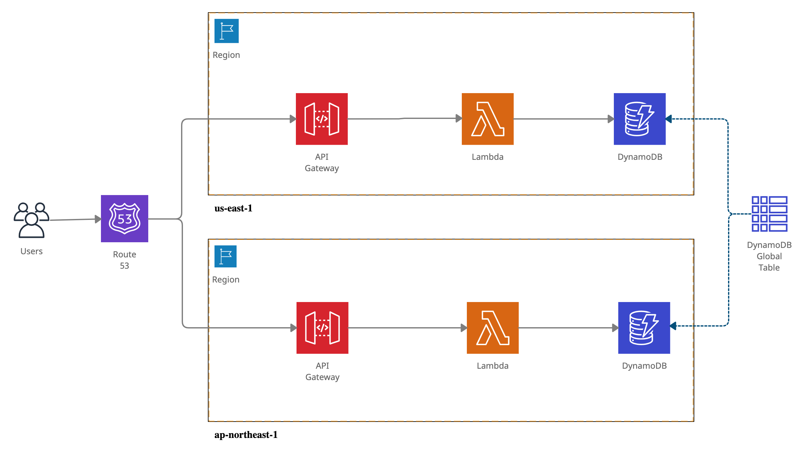

# serverless-multi-region

This plugin will add the resources to configure API Gateway regional endpoints and a global endpoint with CloudFront.

This plugin will:

- Set up API Gateways for your lambdas in each region
- Set up a custom domain in each region for the API Gateway and specify the appropriate base path
- Set up CloudFormation in front of Route 53 failover with TLS 1.2 specified
- Set up Route 53 with the desired domain name in front of CloudFront




1. Install plugin:

```
npm install serverless-multi-region --save-dev
```

2. Create your hosted zone and certificates

> Using the diagram above as an example the hosted zone would be for _example.com_ and the certificate would be for _*.example.com_.
> Create the same certificate in each region to support the regional endpoints. The global endpoint requires a certificate in the us-east-1 region.

3. serverless.yml:

```
plugins:
  - serverless-multi-region

# Add this to the standard SLS "custom" region
custom:
  # The API Gateway method CloudFormation LogicalID to await. Defaults to ApiGatewayMethodProxyVarAny.
  # Aspects of the templates must await this completion to be created properly.
  gatewayMethodDependency: ApiGatewayMethodProxyVarAny

  # Settings used for API Gateway and Route 53
  dns:
    domainName: ${self:service}.example.com
    # Explicity specify the regional domain name.
    # This must be unique per stage but must be the same in each region for failover to function properly
    regionalDomainName: ${self:custom.dns.domainName}-${opt:stage}
    # Settings per region for API Gateway and Route 53
    us-east-1:
      # Specify a certificate by its ARN
      acmCertificateArn: arn:aws:acm:us-east-1:870671212434:certificate/55555555-5555-5555-5555-5555555555555555
      # Failover type (if not present, defaults to Latency based failover)
      failover: PRIMARY
    ap-northeast-1:
      acmCertificateArn: arn:aws:acm:ap-northeast-1:111111111111:certificate/55555555-5555-5555-5555-5555555555555555
      failover: SECONDARY

  # Settings used for CloudFront
  cdn:
    # Indicates which CloudFormation region deployment used to provision CloudFront (because you only need to provision CloudFront once)
    region: us-east-1
    # Aliases registered in CloudFront
    # If aliases is not present, the domain name is set up as an alias by default.
    # If *no* aliases are desired, leave an empty aliases section here.
    aliases:
      - ${self:custom.dns.domainName}
    # Add any headers your CloudFront requires here
    headers:
      - Accept
      - Accept-Encoding
      - Authorization
      - User-Agent
      - X-Forwarded-For
    # Specify a price class, PriceClass_100 is the default
    priceClass: PriceClass_100
    # Specify your certificate explicitly by the ARN
    # If the certificate is not specified, the best match certificate to the domain name is used by default
    acmCertificateArn: ${self:custom.dns.us-east-1.acmCertificateArn}
    # Set up logging for CloudFront
    logging:
      bucket: example-auditing.s3.amazonaws.com
      prefix: aws-cloudfront/api/${opt:stage}/${self:service}
    # Add the webACLId to your CloudFront
    webACLId: id-for-your-webacl
```
4. Deploy to each region

You've got your configuration all set.

Now perform a serverless deployment to each region you want your Lambda to operate in.
The items you have specified above are set up appropriately for each region and non-regional resources such as CloudFront and Route 53 are also set up via CloudFormation in your primary region.

You now have a Lambda API with cross-region failover!!!


## Related Documentation
* [Building a Multi-region Serverless Application with Amazon API Gateway and AWS Lambda](https://aws.amazon.com/blogs/compute/building-a-multi-region-serverless-application-with-amazon-api-gateway-and-aws-lambda)
